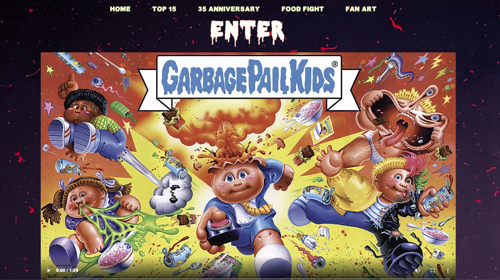

# Garbage Pail Kids

#####
## Description of App
Created my first fullstack app with full CRUD functionality that utilizes EJS to implement front end. Adhered to the MVC file structure and applied all 7 RESTful routes. For card collectors to contribute, update and add new cards to each collection. Collectors can now find info on each card and add more to the set. I tried to maked it UI friendly by mocking the cards and forms to look like actual GPK cards. 

**Visit Heroku Deploy:** [GPK DB](https://gpkcards.herokuapp.com/)

### Languages and Frameworks Used
- HTML 5
- Javascript
- Express
- CSS
- Node.JS
- MongoDB
- Mongoose
- EJS
